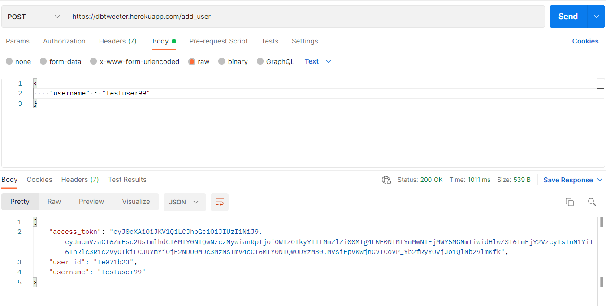

# Basic Twitter clone API

This is an API written in python-flask which serves some endpoints to perform a mix of user functions.

## Salient Features
1. Creates UUIDs for tweets and internal user ids for an relaible unqiue attribute for both tweets and users.
2. Implements JWT tokens
3. Uses a cloud-hosted PostgreSQL as the database for storing tweet and userdata.
4. SQLAlchemy for the ORM layer.

## APIs

### 1. Add user (/add_user)
This API accepts a username string and returns the jwt token, user id and username upon invocation.
It can check for duplicate userids and throw violation.

