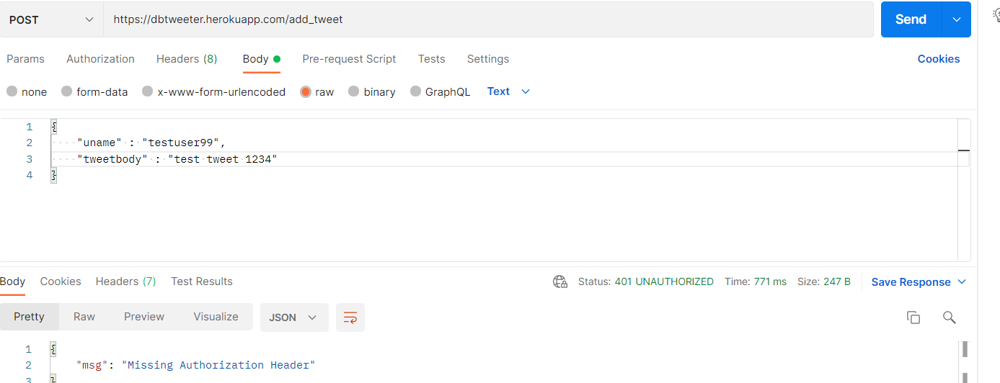

# Basic Twitter clone API

This is an API written in python-flask which serves some endpoints to perform a mix of user functions.

### Salient Features
1. Creates UUIDs for tweets and internal user ids for an relaible unqiue attribute for both tweets and users.
2. Implements JWT tokens
3. Uses a cloud-hosted PostgreSQL as the database for storing tweet and userdata.
4. SQLAlchemy for the ORM layer.

## APIs

### 1. Add user (/add_user)
This API accepts a username string and returns the jwt token, user id and username upon invocation.
It can check for duplicate userids and throw violation.

if the username already exists.

### 2. Create tweet (/add_tweet)
This API accepts the tweet text, username and the jwt token and stores a tweet into the postgres db.
It has jwt authentication.

If jwt is not supplied.

### 3. Pull tweets not older an a date (/tweet_hist)
This API accepts the username, date and jwt token to show comma separated tweets not older than a date and the total count of those tweets.
It has jwt authentication.

If no tweets found.

### 4. Delete tweets of a user (/tweet_delete)
This API takes the username and the jwt token to delete all tweets of the user. It shows the number of tweets deleted alongwith the tweet ids and their corresponding texts.
#### Improvement would have been to show the tweets in a nested json, but due to time constraints the output shows tweets in the format "<tweet id> :: <tweet text>".
  

